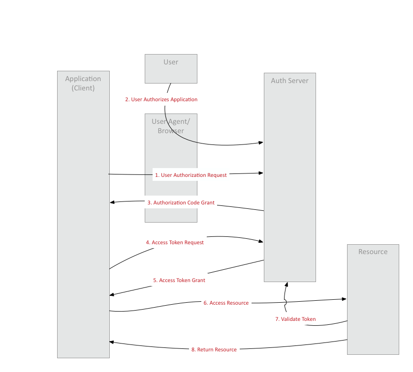

# Spring with Cloud Foundry UAA for OAuth2

Overview

## Description

- [Resource Server](https://github.com/shinyay/spring-with-uaa-resource-server)
I prepared UAA environment as the following procedure;

### Cloud Foundry UAA
#### Clone from GitHub as submodule
```
$ git submodule add https://github.com/cloudfoundry/uaa.git
```

## Demo

## Features

- feature:1
- feature:2

## Requirement

## OAuth2 Configuration

```
spring:
  security:
    oauth2:
      client:
        registration:
          uaa:
            client-name: Web App Client
            client-id: webappclient
            client-secret: webappclientsecret
            scope: resource.read,resource.write,openid,profile
        provider:
          uaa:
            issuer-uri: http://localhost:8080/uaa/oauth/token
```
## Usage
### Run UAA Server
#### Datasource for UAA
```
$ set -x SPRING_PROFILES "default,hsqldb"
```

#### Key pair for JWT
```
$ openssl genrsa -out signingkey.pem 2048
$ openssl rsa -in signingkey.pem -pubout -out verificationkey.pem
```

#### Run UAA Server
```
$ cd uaa
$ ./gradlew run
```

### Clients and Users Population with using UAAC
#### Target UAA
```
$ uaac target http://(hostname):8080/uaa
```

#### Retrieve Token from UAA
```
$ uaac token client get admin -s adminsecret
```

#### Register UAA Client
```
$ uaac client add webappclient -s webappclientsecret \
--name WebAppClient \
--scope resource.read,resource.write,openid,profile,email,address,phone \
--authorized_grant_types authorization_code,refresh_token,client_credentials,password \
--authorities uaa.resource \
--redirect_uri http://localhost:8081/login/oauth2/code/uaa
```

#### Create User
```
$ uaac user add appuser -p appusersecret --emails appuser@pivotal.io
```

#### Create Group
```
$ uaac group add resource.read
$ uaac group add resource.write
```

#### Assign Group to User
```
$ uaac member add resource.read appuser
$ uaac member add resource.write appuser
```

### Run OAuth2 Client App
```
$ ./mvnw spring-boot:run
```

#### Open OAuth2 Client App
```
$ open http://(hostname):8081/login
```

- USERID: appuser
- PASSWD: appusersecret

### Configure Application Authorization
- `resource.write`: OFF

## Installation

## Licence

Released under the [MIT license](https://gist.githubusercontent.com/shinyay/56e54ee4c0e22db8211e05e70a63247e/raw/34c6fdd50d54aa8e23560c296424aeb61599aa71/LICENSE)

## Author

[shinyay](https://github.com/shinyay)
